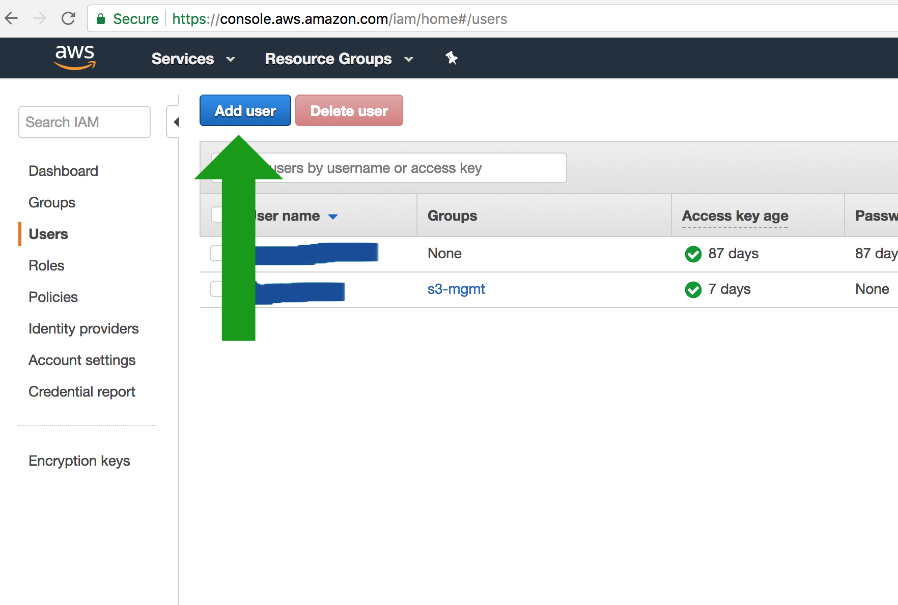
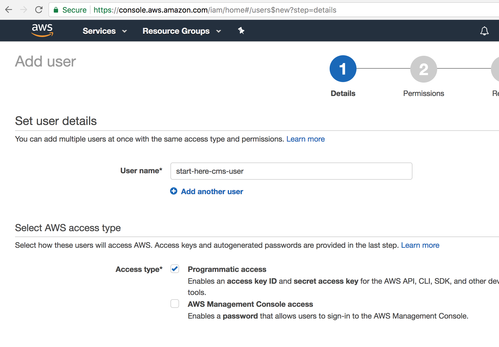
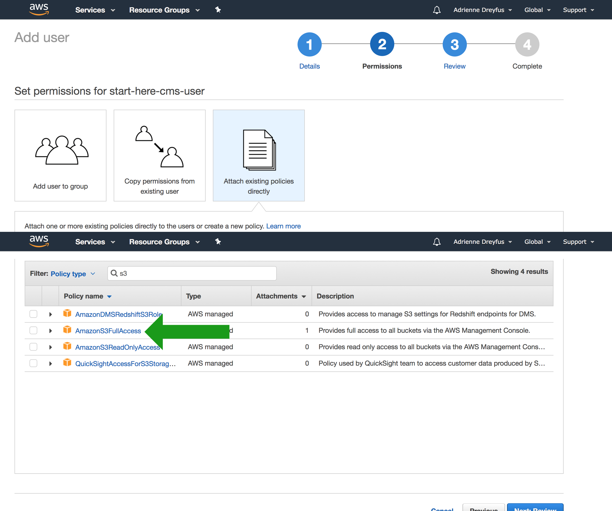
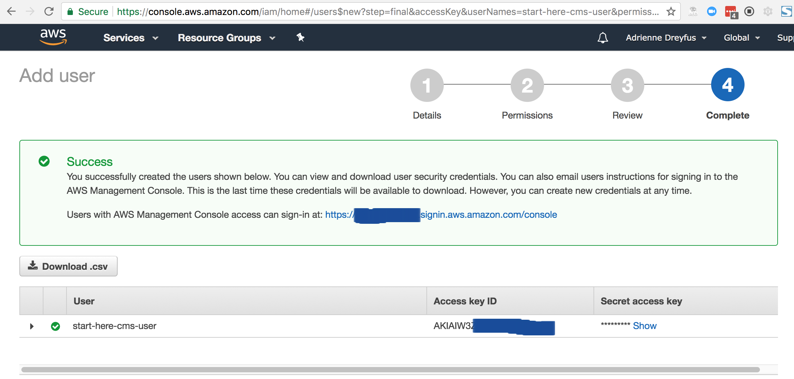
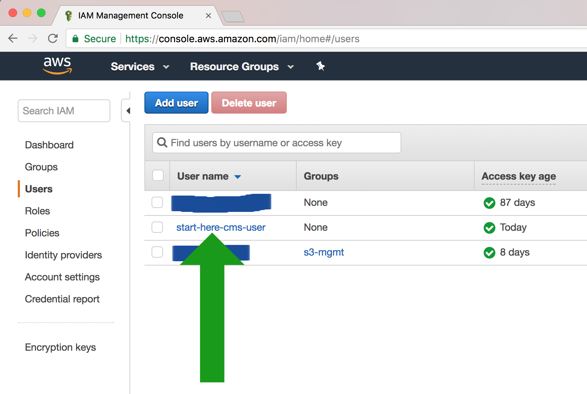
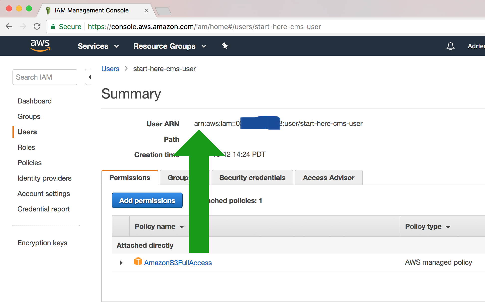
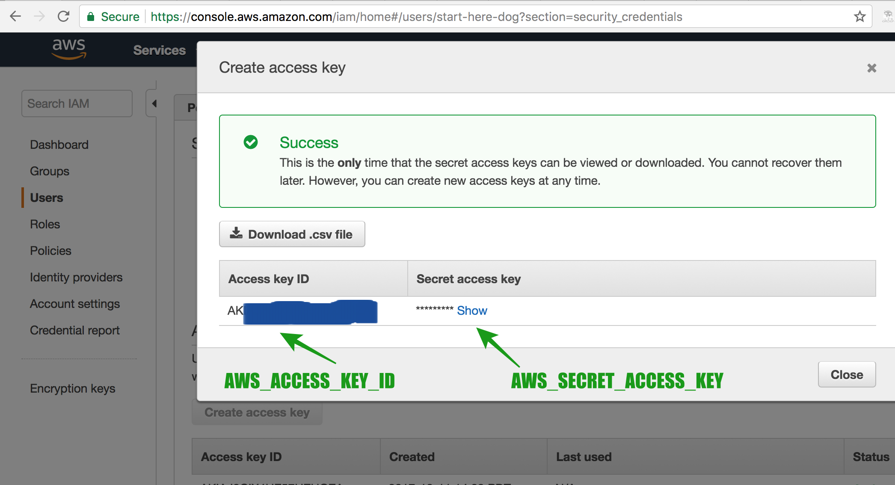
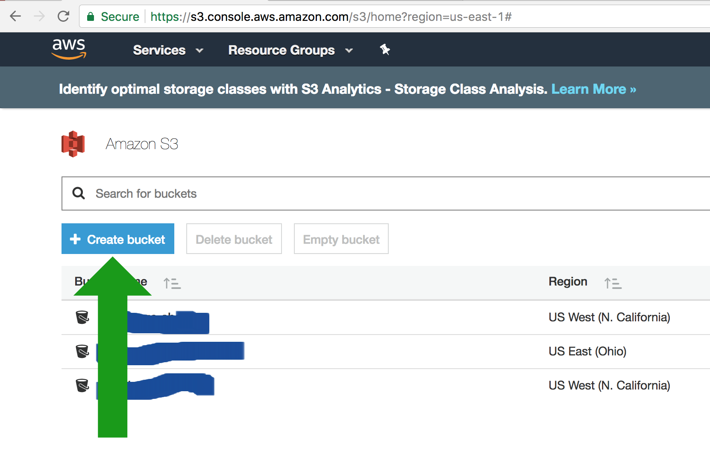
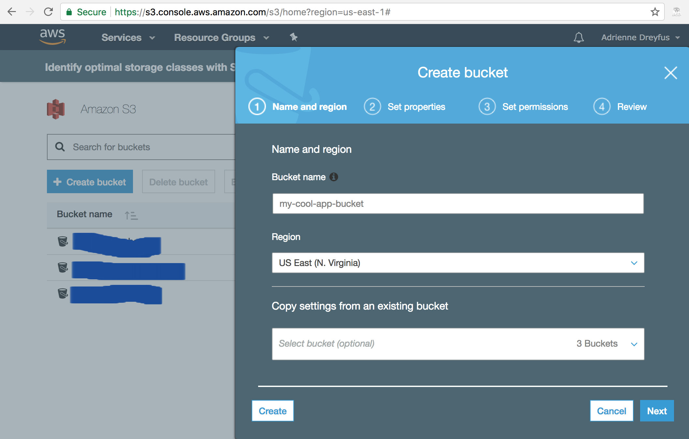

==============
Setting up AWS
==============

We use Amazon Web Services (AWS) to store images and documents you want to upload to your website. Set up is free and
simple.

We will need three pieces of information from you: the S3 bucket name (AWS_STORAGE_BUCKET_NAME),
your AWS access key (AWS_ACCESS_KEY_ID), and your secret access key (AWS_SECRET_ACCESS_KEY).

**This is the hardest part of the setup.** We will walk you through each step, be sure to write down the pieces of
information we tell you to write down. Some of the values are obscured in the example images to project our data, but
you should write down the full values you see.

.. _create_aws_user:

'''''''''''''''''''''''
Creating a new AWS user
'''''''''''''''''''''''

Sign up and create your AWS account.

Go to the `IAM Management Console <https://console.aws.amazon.com/iam/home#/users>`_ and create a new user by clicking on the Add user link.

Create a new user and give them "Programmatic access"

Next, on the permissions page you can simply grant them access to AmazonS3FullAccess policy in the
"Attach existing policies directly" tab. Feel free to grant additionally levels of access if you plan on using this
user for different projects.

Finally you should see this success screen with information about your user.
**Write down the Access key ID and Secret access key.** We will use these to set up your application.

Go back to your `AWS IAM Users console <https://console.aws.amazon.com/iam/home#/users>`_. You should see the name
of the user you just created. Click on the username you just created.

.. _user_arn:

Write down the value you see for User ARN. We will use this when we create our AWS bucket.

Great! Now let's :ref:`make the bucket <aws_bucket>`

.. _aws_existing_user:

'''''''''''''''''''''''''''''''''''''''''''''''''''''''
Creating a new security access key with an old AWS user
'''''''''''''''''''''''''''''''''''''''''''''''''''''''
**If you just did the above steps and created a user you can skip this step.** This is only for people setting up a new AWS bucket with an existing user.

Go to your `IAM console <https://console.aws.amazon.com/iam/home>`_ to get your AWS_ACCESS_KEY_ID and AWS_SECRET_ACCESS_KEY. This can be tricky to find
so here are some images to guide you there:

First click on the Users link -- (if you don't have any Users :ref:`create one first <create_aws_user>`)

Next, select the user whose information you want to use.

.. image:: _static/aws/aws_2.png
    :alt: The AWS IAM screen

Then go to their Security credentials tab. **Write down your User's ARN** We will use this value when we make our bucket.

.. image:: _static/aws/aws_3.png
    :alt: The AWS IAM screen

You're going to want to create an access key for them.

.. IMPORTANT::
    Once you generate an access key, you only have one chance to write the SECRET_ACCESS_KEY down. Be sure to record this!

.. image:: _static/aws/aws_4.png
    :alt: The AWS IAM screen

.. _aws_access_key:

Write down your AWS_ACCESS_KEY_ID and AWS_SECRET_ACCESS_KEY

Now that you have your AWS_STORAGE_BUCKET_NAME, AWS_ACCESS_KEY_ID, and AWS_SECRET_ACCESS_KEY written down you should be
:doc:`good to go. <quickstart>`

.. _aws_bucket:

'''''''''''''''''''''''''
Creating a new AWS bucket
'''''''''''''''''''''''''

Now that we have our user, creating the bucket will be easy. You can follow our guide below but we also suggest reading
`AWS's documentation <http://docs.aws.amazon.com/AmazonS3/latest/user-guide/create-bucket.html>`_ on how to set one up.

Go to your `AWS S3 console <https://s3.console.aws.amazon.com/s3/home>`_ and click on the "Create bucket" button.

.. _aws_bucket_name:

Pick a name that's related to the website you're creating. **Write down this name.** We will use it later as BUCKET-NAME.
Keep clicking next and choose the default setup Amazon suggests.

Now you should see your bucket listed in your `AWS S3 console <https://s3.console.aws.amazon.com/s3/home>`_.
Click on that bucket and then click on the "Permissions" tab, followed by the "Bucket Policy" button.

.. image:: _static/aws/sample_policy.png
    :alt: The Bucket Policy view in the Permissions tab

Enter the following text in the Bucket policy editor except replace BUCKET-NAME with the name of the bucket you just
created (in my case that would be my-cool-app-bucket) and replace USER-ARN with your User ARN you :ref:`wrote down earlier <user_arn>`.

Be sure to remember to click the Save button.

.. code:: javascript

    {
        "Version": "2008-10-17",
        "Statement": [
            {
                "Sid": "PublicReadForGetBucketObjects",
                "Effect": "Allow",
                "Principal": {
                    "AWS": "*"
                },
                "Action": "s3:GetObject",
                "Resource": "arn:aws:s3:::BUCKET-NAME/*"
            },
            {
                "Effect": "Allow",
                "Principal": {
                    "AWS": "USER-ARN"
                },
                "Action": "s3:*",
                "Resource": [
                    "arn:aws:s3:::BUCKET-NAME",
                    "arn:aws:s3:::BUCKET-NAME/*"
                ]
            }
        ]
    }

Click on the CORS configuration button and make sure it says:

.. code:: xml

    <CORSConfiguration>
        <CORSRule>
            <AllowedOrigin>*</AllowedOrigin>
            <AllowedMethod>GET</AllowedMethod>
            <MaxAgeSeconds>3000</MaxAgeSeconds>
            <AllowedHeader>Authorization</AllowedHeader>
        </CORSRule>
    </CORSConfiguration>

PHEW! We're ready to roll. Make sure you have your :ref:`AWS Access ID, Secret Key <aws_access_key>` and :ref:`Bucket Name <aws_bucket_name>` handy
and head on over to the :ref:`next step <deploy_heroku>`.

