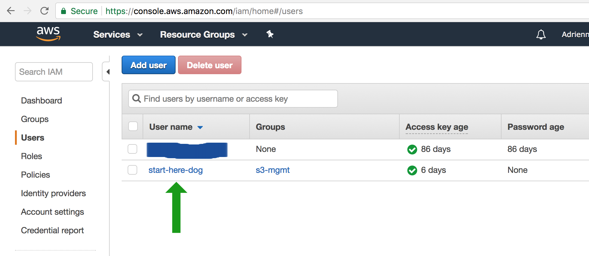
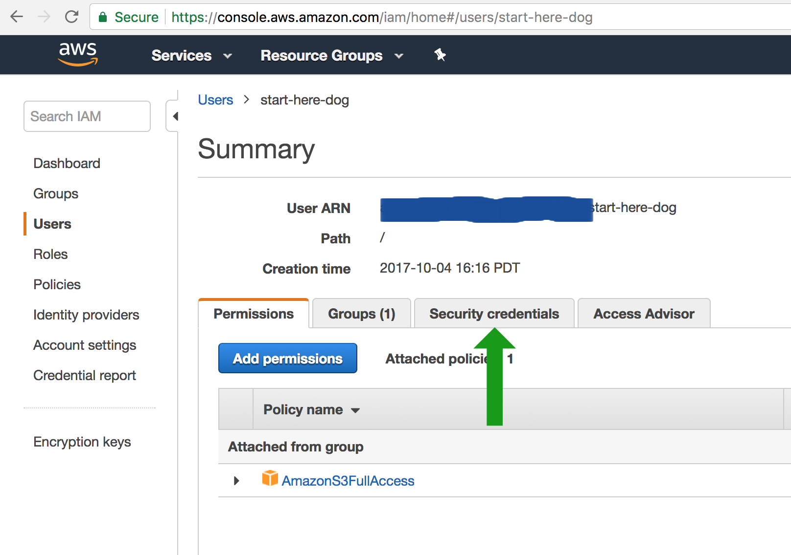

==============
Setting up AWS
==============

We use Amazon Web Services (AWS) to store images and documents you want to upload to your website. Set up is free and
simple.

We will need three pieces of information from you: the S3 bucket name (AWS_STORAGE_BUCKET_NAME),
your AWS access key (AWS_ACCESS_KEY_ID), and your secret access key (AWS_SECRET_ACCESS_KEY)

.. _aws_bucket:

''''''''''''''''''''''''
Creating your AWS bucket
''''''''''''''''''''''''

1. Sign up and create your AWS account.
2. Follow `this blog post <https://wagtail.io/blog/amazon-s3-for-media-files/>`_ until you get to "Your S3 bucket is now ready to roll!" That means you're ready to roll!
3. Write down your BUCKET-NAME -- this will be the value for AWS_STORAGE_BUCKET_NAME

.. _aws_keys:

''''''''''''''''''''''''''''''
Creating a security access key
''''''''''''''''''''''''''''''

Go to your `IAM console <https://console.aws.amazon.com/iam/home>`_ to get your AWS_ACCESS_KEY_ID and AWS_SECRET_ACCESS_KEY. This can be tricky to find
so here are some images to guide you there:

First click on the Users link -- if you don't have any Users create one first.

.. image:: _static/images/aws_1.png
    :alt: The AWS IAM screen

Next, select the user whose information you want to use.

Then go to their Security credentials tab.

You're going to want to create an access key for them.

.. IMPORTANT::
    Once you generate an access key, you only have one chance to write the SECRET_ACCESS_KEY down. Be sure to record this!

.. image:: _static/images/aws_4.png
    :alt: The AWS IAM screen

Write down your AWS_ACCESS_KEY_ID and AWS_SECRET_ACCESS_KEY

.. image:: _static/images/aws_5.png
    :alt: The AWS IAM screen

Now that you have your AWS_STORAGE_BUCKET_NAME, AWS_ACCESS_KEY_ID, and AWS_SECRET_ACCESS_KEY written down you should be
:doc:`good to go. <quickstart>`
