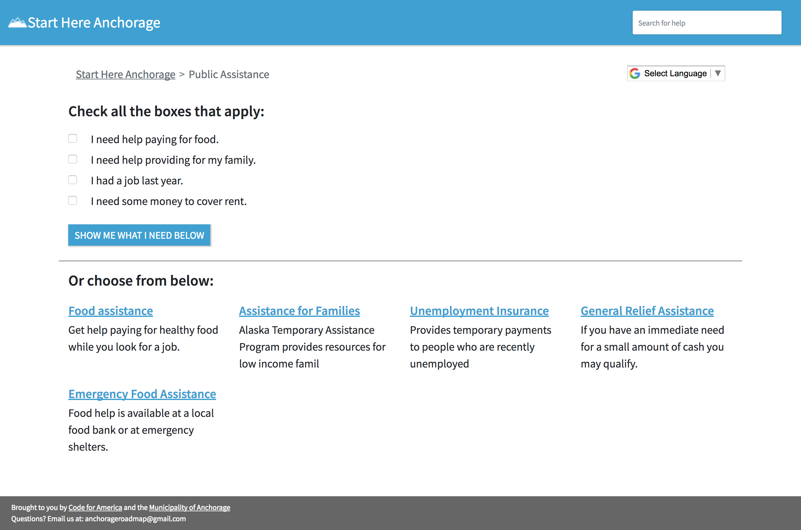
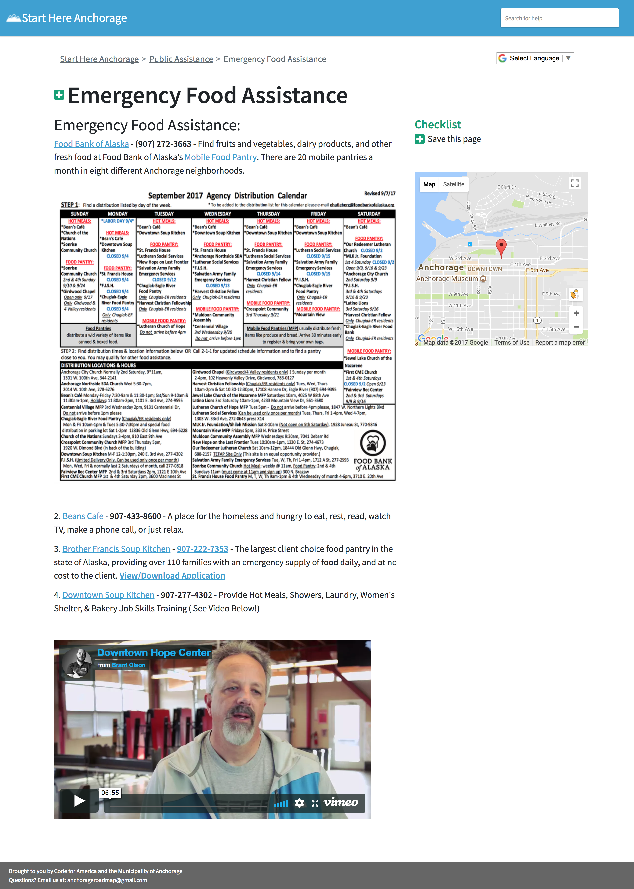

CMS structure overview
**********************

.. toctree::
   :maxdepth: 2
   :titlesonly:

   wagtail/home_page
   wagtail/track_page
   wagtail/step_page

The website consists of three main page types: :ref:`Home <home_page>`, :ref:`Tracks <track>`, and :ref:`Steps <step>`.

==========
Home Page
==========

The :doc:`Home Page <wagtail/home_page>` lists the primary available service categories for users to take in the journey.
In the case of workforce services, these are the primary needs to be met for a job seeker to become job ready.

.. figure:: _static/images/homepage.png
   :alt: Sample homepage

   *An example of a Home page*

=====
Track
=====

Selecting a :doc:`Track <wagtail/track_page>` on the Home Page, will take the user to the Track Page which has two features:

    1. A variety of available service options in this category.

        * For example, on the “Public Assistance” track, there will be a list of service options like "Emergency Food Assistance" and "Unemployment Insurance"
    2. A brief quiz to help the user narrow down the options that best fit their situation.

   *An example of a Track page*

====
Step
====

A :doc:`Step <wagtail/step_page>` gives the steps needed to take to achieve the goal of the Track. Depending on the service, the Step will either function to provide:

    1. A list of services, their contact information and their concise bullet-point list of ‘need to know’ information to help the user decide on taking action.
    2. A brief summary of ‘need to know’  information on a specific topic or service of interest. Links to applications and sources should be hyperlinked to keywords for users to learn more information.

In the case of the “Public Assistance” Track example, the step page for Emergency Food Assistance [shown above] had a broad range of service options and thus modeled function #1.

   *An example of a Step page*
