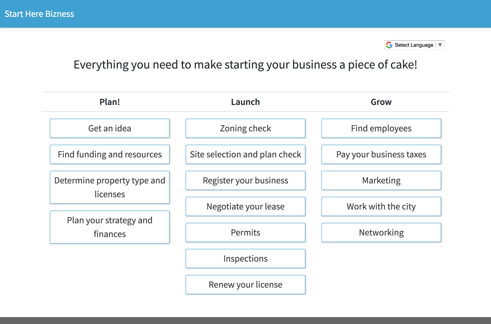

=======================
Small business template
=======================

Template name to enter in Heroku console
----------------------------------------
bizness

About
-----

The bizness template was quickly created after a previous Code for America fellowship launched
a `small business portal <https://bizport.longbeach.gov>`_ for Long Beach.

Many small business owners find themselves overwhelmed with the tasks they need to do to launch
or grow their business. The Long Beach fellowship team spent time coming up with the following
tracks to help guide a user through this complicated process.

This templates ships with the following tracks we suggest you fill out:

* Find an idea
* Get funding
* Property type and licenses
* Strategy/Finances
* Zoning laws
* Site selection planning
* Registering your business
* Negotiating a lease
* Permits
* Inspections
* Renewing licenses
* Finding employees
* Taxes
* Marketing
* Working with the city
* Networking

Preview
-------

Creator
-------
`Adrienne <https://github.com/adrind>`_

