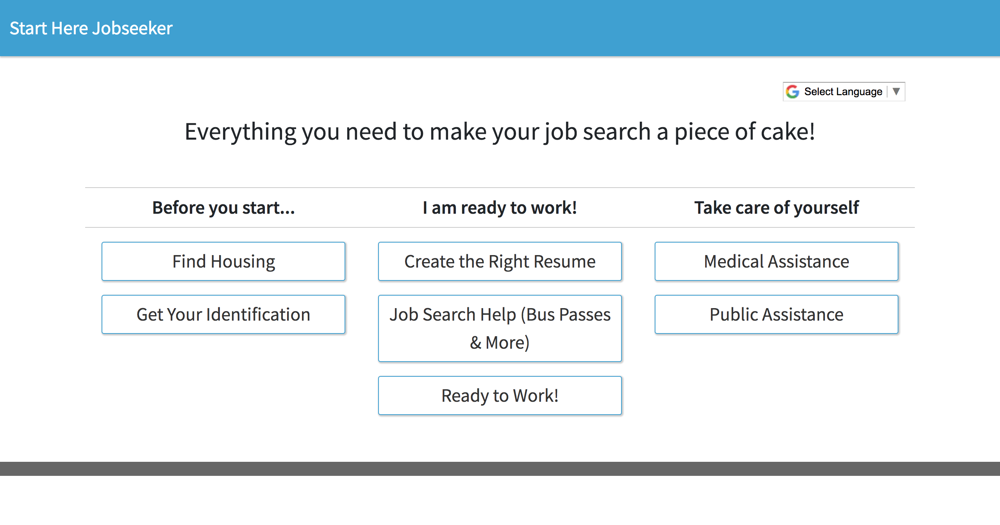

==================
Jobseeker template
==================

Template name to enter in Heroku console
----------------------------------------
jobseeker-template

About
-----

The jobseeker template is perfect to make a guide to help jobseekers in your city discover
workforce services.

During our fellowship in Anchorage, we found that many jobseekers need help getting their
basic needs in order before they are stable enough to start looking for the job of their dreams.

This templates ships with the following tracks we suggest you fill out:

* Housing
* Identification
* Creating the Right Resume
* Job Search Help (Bus passes, interview clothes, local workshops, etc)
* Ready to Work! (Job posting websites)
* Medical Assistance
* Public Assistance

Preview
-------

Creator
-------
`Adrienne <https://github.com/adrind>`_ and `Clorama <https://github.com/Clorama>`_
