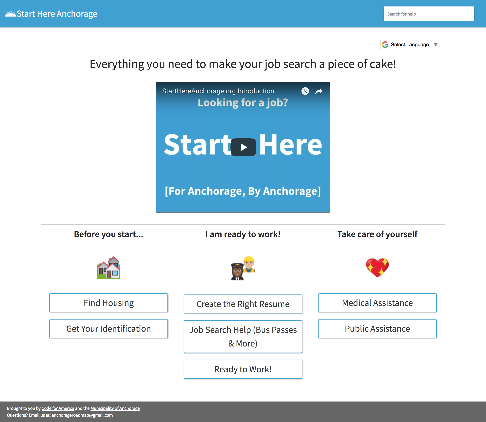

.. Start Here CMS documentation master file, created by
   sphinx-quickstart on Tue Oct 10 15:51:46 2017.
   You can adapt this file completely to your liking, but it should at least
   contain the root `toctree` directive.

StartHereCMS
==============

StartHereCMS was the result of the 2017 `Code for America Anchorage fellowship team <https://cfa-muni.tumblr.com>`_
when we designed an easy to use content management system to outline services in Anchorage that could help a jobseeker during their employment search.

It was created after our research lead us to understand that most government services rely on a web of
community organizations and support. We wanted to make this CMS as flexible as possible so other organizations can create their own CMS without writing any code.

.. toctree::
   :maxdepth: 2
   :titlesonly:

   intro
   quickstart
   tutorial
   cms-structure
   technical
   faq

Resources
---------

- `Source Code <https://github.com/adrind/startherecms>`_
- `Google Drive version of the Documentation <https://docs.google.com/document/d/1aFxM2USx8XSeQVUm7Ps8uispRC1mbc9iyDUbffIvTEY/edit?usp=sharing>`_
- `Research blog <https://cfa-muni.tumblr.com>`_
- :ref:`Search the documentation <search>`

Reach out
---------

If you are having issues with this project, please let us know: `anchorageroadmap@gmail.com <mailto:anchorageroadmap@gmail.com>`_