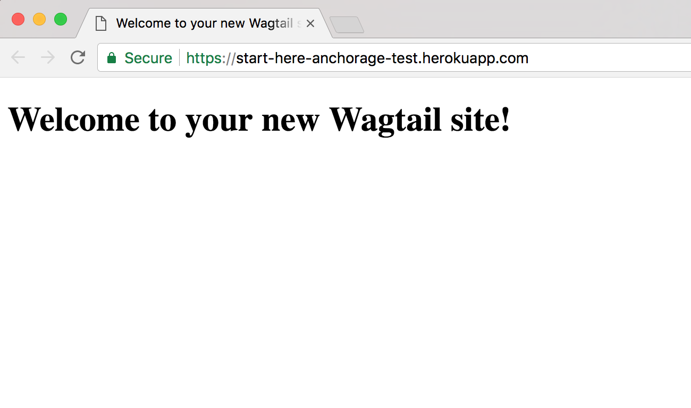

Quickstart
**********

.. toctree::
    :hidden:

    quickstart/aws
    quickstart/google_maps
    quickstart/google_analytics
    quickstart/algolia
    quickstart/local_deploy
    quickstart/templates

Starting your own version of StartHereCMS can be done in 30 minutes.
Once you have your Heroku and AWS accounts set up it's as simple as clicking a button!

.. raw:: html

    

        <iframe width="560" height="315" src="https://www.youtube.com/embed/040D4NJkZ-0" frameborder="0" allowfullscreen></iframe>
    

==========================
How to start a new website
==========================
There are a couple of services you need to sign up for before deploying your website to Heroku:

1. A `Heroku <https://www.heroku.com>`_ account
2. An :doc:`Amazon Web Services <quickstart/aws>` account

.. _config_vars:

Once you sign up for these services you need the following keys to launch your application:

.. csv-table:: Required keys to create the website
   :header: "Name of key", "How to find it", "Example value"
   :widths: 15, 30, 10

   "AWS_ACCESS_KEY_ID", :ref:`Find your access key <aws_existing_user>`, KUDFHGJKHRUFDBF
   "AWS_SECRET_ACCESS_KEY", :ref:`Create a secret key <aws_existing_user>`, 2IUGFD/8vD9/k7s6
   "AWS_STORAGE_BUCKET_NAME", :ref:`Create your bucket <aws_bucket>`, start-here-dog-files

Additionally there are some optional (free!) services you can use for added functionality:

* :doc:`Google Analytics <quickstart/google_analytics>` -- used to track how people use your website
* :doc:`Google Maps <quickstart/google_maps>` -- used to let you set locations of community organizations on a map
* :doc:`Algolia <quickstart/algolia>` -- used to power a search box on your website so people can easily find pages

.. csv-table:: Optional keys for additional services
   :header: "Name of key", "How to find it", "Example value"
   :widths: 15, 30, 10

   "GOOGLE_MAPS_API_KEY", :doc:`Get your API key <quickstart/google_maps>`, AIv80f_8tueriogjURGYE
   "GOOGLE_WIDGET_DEFAULT_LAT", `Find your latitude <http://www.worldatlas.com/aatlas/findlatlong.htm>`_ , 37.773972
   "GOOGLE_WIDGET_DEFAULT_LONG", `Find your longitude <http://www.worldatlas.com/aatlas/findlatlong.htm>`_ , -122.431297
   "ALGOLIA_APP_ID", Guide coming soon, Q87VFIUEH
   "ALGOLIA_API_KEY", Guide coming soon, ce0896nbfsHUGfdgrz9b

.. _deploy_heroku:

Once you have a Heroku account and an AWS bucket set up, you can start! Click the deploy button to create your project in Heroku:

.. image:: https://www.herokucdn.com/deploy/button.svg
    :alt: Deploy to Heroku button
    :align: center
    :target: https://heroku.com/deploy?template=https://github.com/adrind/startherecms

This will prompt you to create an admin username + password. Remember what you type! We will use this account information
to login later. Viewing your app after Heroku builds it should show a simple "Hello World" website like this:

Need a template to help you get started? Pick from :doc:`our community sourced list <quickstart/templates>`.

Want a full walk through on how to structure and setup your website from scratch? Follow our :doc:`Tutorial <tutorial>`!