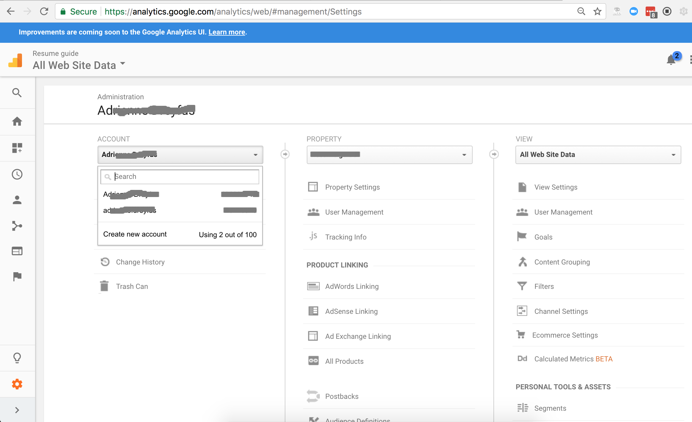
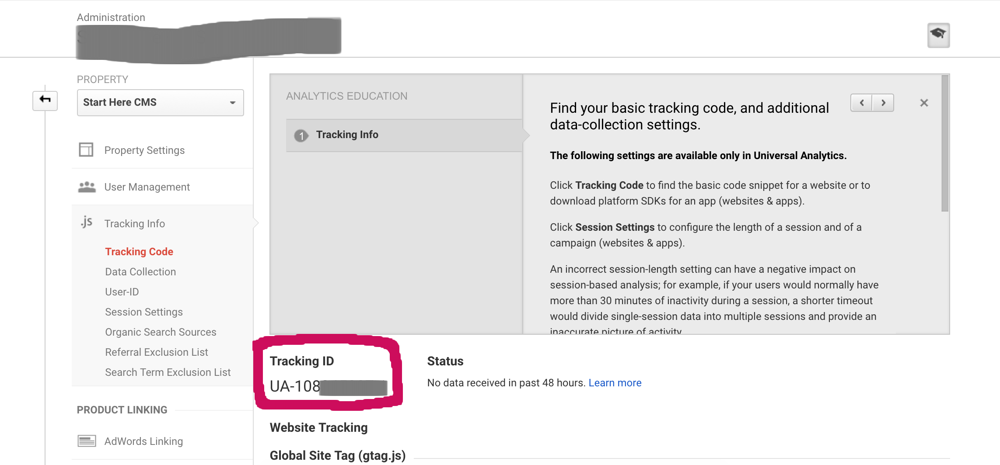

===========================
Setting up Google Analytics
===========================

You can use Google Analytics to track what pages your website visitors go to.

1. Go to `Google Analytics <https://analytics.google.com/>`_ and sign in with your Google account.
2. Go to your `Admin settings <https://analytics.google.com/analytics/web/#management/Settings>`_.
3. Select Create new account from the Accounts drop down

4. Fill out the relevant information and select "Get Tracking ID"
5. Once you accept the Terms and Conditions you should have your Tracking ID!

Add this Tracking ID to your :doc:`Site Settings <../tutorial/site_settings>` in the Google Analytics ID text box.