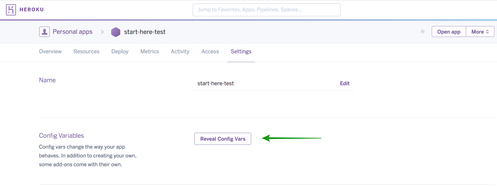

Technical documentation
***********************

So you're interested in knowing what's going on under the hood. Good for you! At its core
StartHereCMS is a Django application that uses `Wagtail <https://www.wagtail.com>`_
to manage the CMS and admin interface.

-----------------------
Running the app locally
-----------------------

Our instructions for :ref:`running the app locally<local_deploy>` are in our Quickstart section.

The app is a Django application so there's a lot of potential for easy extensions.
We used Wagtail to manage and structure the CMS, which are simply
models and templates in the roadmap app (note: the Homepage and SiteSettings models
appear in the home app).

Any development questions can probably be solved with the `Django <https://www.djangoproject.com/>`_ and Wagtail documentation.

-----------------
Upgrading Wagtail
-----------------

Let’s say you really want to update Wagtail from version 1.12 to 1.12.1

* Upgrade the line in the project’s requirements.txt file: wagtail==1.12.1
* Run ``pip install -r requirements.txt`` from the root directory
* Run ``python manage.py makemigrations`` and ``python manage.py migrate``
* Commit the new migration file and push it up to heroku
* Run ``heroku run python manage.py migrate``

We don't really recommend this since upgrading could affect the stability of the application, especially
with the custom components like the Wagtail form builder.

-----------------------------
Troubleshooting in production
-----------------------------

If you start seeing weird behavior and getting 500 errors you can turn the app into staging mode which will give you a
full stacktrace of your errors. In the Heroku config vars set::

    DJANGO_SETTINGS_MODULE=startherecms.settings.staging

Be sure to set it back to::

    DJANGO_SETTINGS_MODULE=startherecms.settings.production

when you're done debugging

.. config_vars:

------------------------------
Updating your config variables
------------------------------

Need to change your AWS bucket information or want to set up :doc:`Algolia <quickstart/algolia>` to add search to your website?
Update your Heroku configuration by going to your app Dashboard Settings.

Clicking the "Reveal Config Vars" should let you edit any of the configuration variables we set up during :doc:`Quickstart <quickstart>`.
Note that some of your configuration also lives in :doc:`Site Settings. <tutorial/site_settings>`
