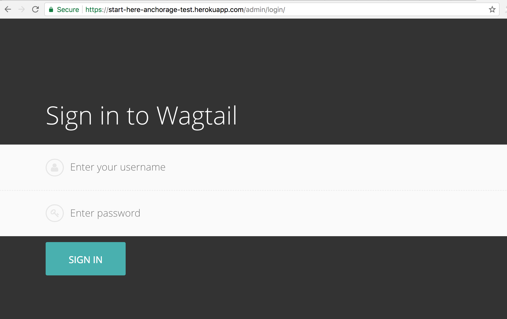
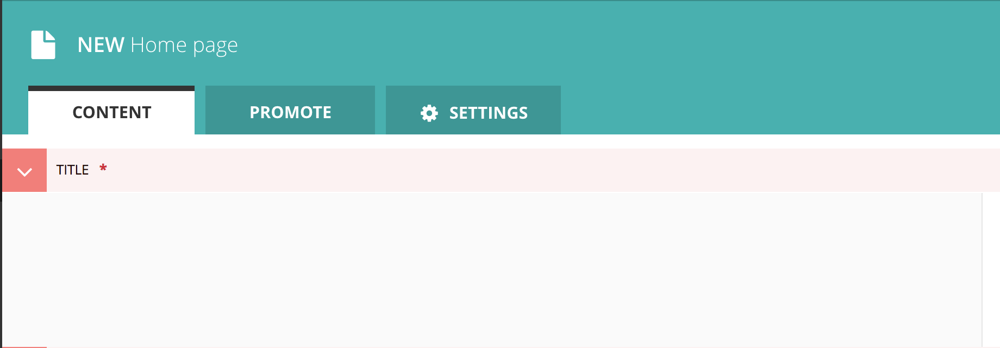

Tutorial - Start Here Dog!
**************************

This tutorial will walk you step by step through creating your own Start Here CMS website.

.. toctree::
    :maxdepth: 1

    tutorial/create_homepage
    tutorial/site_settings
    tutorial/website_structure
    tutorial/create_track
    tutorial/create_step
    tutorial/create_track_form
    tutorial/extra_step_features

We assume you've taken the steps to :doc:`sign up and launch your version<../quickstart>` of the CMS to Heroku, have a
:doc:`basic understanding of our CMS structure<../cms-structure>`, and currently have a website that looks like this:

.. image:: _static/tutorial/basic_wagtail_app.png
    :align: left
    :alt: A basic homepage for a Wagtail application

And logging into the admin view at http://you-heroku-app-name.herokuapp.com/admin should look like this:

Use the username and password you created during the :doc:`Quickstart <quickstart>` section to login. 

-----------
Definitions
-----------
Going forward we'll use some icons to let you know about definitions and extra resources:

.. image:: _static/tutorial/youtube_icon.png
    :align: left
    :alt: An icon of a movie playing

This icon means we have a link to a YouTube video to see a full walkthrough

.. image:: _static/tutorial/definition_icon.png
    :align: left
    :alt: A magnifying glass

This icon means we are about to define a field in the Wagtail admin like the one below:

Now we're ready to make a website!

.. container:: next

    .. admonition:: Let's get started

        Step 1: :doc:`tutorial/create_homepage`