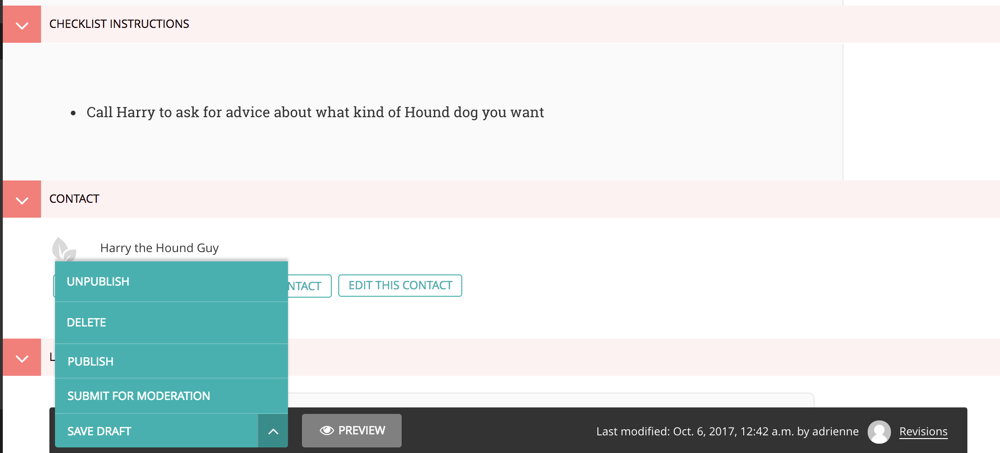

==============================
Basic understanding of Wagtail
==============================

Before starting this tutorial we assume you have a basic understanding of Wagtail and how its editing interface works.
We suggestion reading `Wagtail's guide <http://docs.wagtail.io/en/v1.12.2/editor_manual/intro.html>`_ to
understand how to use the editor.

When you make changes to a page in the Wagtail admin there are several options available:

**Unpublish:** Takes the page down from the public website but still save the draft in case you want to republish it.

**Delete:** Permanently deletes the page.
Only delete if you never want to publish this page or the information on it ever again.

**Publish:** Makes any changes you made public and published to the website.

**Submit for moderation:** Notifies other admins that you made some changes that you want someone to review.
These changes will not be published to the website until the changes are approved by a moderator or admin.

**Save as Draft:** Saves the page as a draft but does NOT publish the changes to the website.

Great, let's add some content: :doc:`create_homepage`