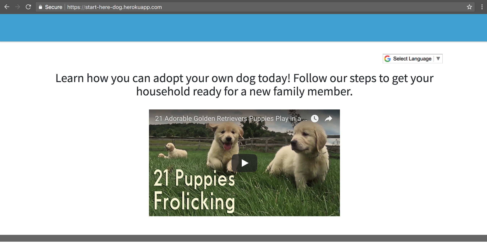

=======================
Create a new Home page
=======================
First things first -- let’s create a very basic homepage. We need to make a new Home page in the Root directory.

.. image:: ../_static/tutorial/youtube_icon.png
    :align: left
    :alt: An icon of a movie playing

`How to create a new home page <https://www.youtube.com/watch?v=K3t1ftvhl-Y&feature=youtu.be>`_

.. image:: ../_static/tutorial/definition_icon.png
    :align: left
    :alt: A magnifying glass

**Title** - The title field is the title of your homepage (appears in the browser tab)

.. image:: ../_static/tutorial/definition_icon.png
    :align: left
    :alt: A magnifying glass

**Mission Statement** - The mission statement is a short description of the goal of your website. Let the user know what they should know how to do after following the steps in your website.

.. image:: ../_static/tutorial/definition_icon.png
    :align: left
    :alt: A magnifying glass

**Video** - An optional video to inform the user what they should expect from your website

We’ll get to **Sections** later after we create some Track and Step pages.

After creating the page in Wagtail we need to set it as the Root page -- this lets Wagtail know that this is the home page.

.. image:: ../_static/tutorial/youtube_icon.png
    :align: left
    :alt: An icon of a movie playing

`How to set the home page as the root page <https://www.youtube.com/watch?v=72E5CyeFRok&feature=youtu.be>`_

By the end of this step you should have a root page that looks something like this:

Next: :doc:`site_settings`