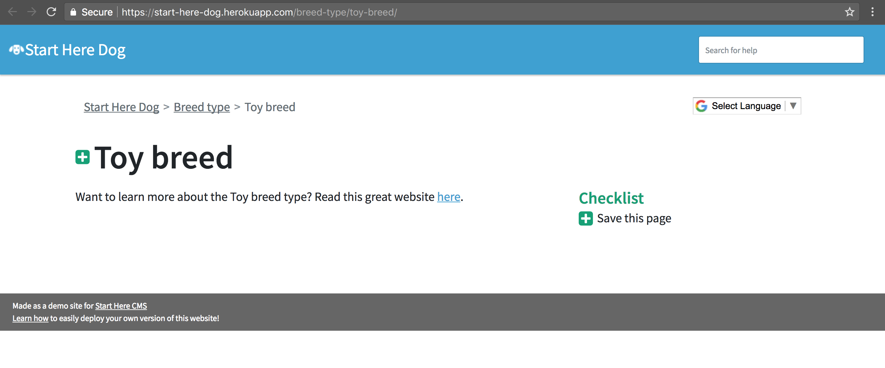
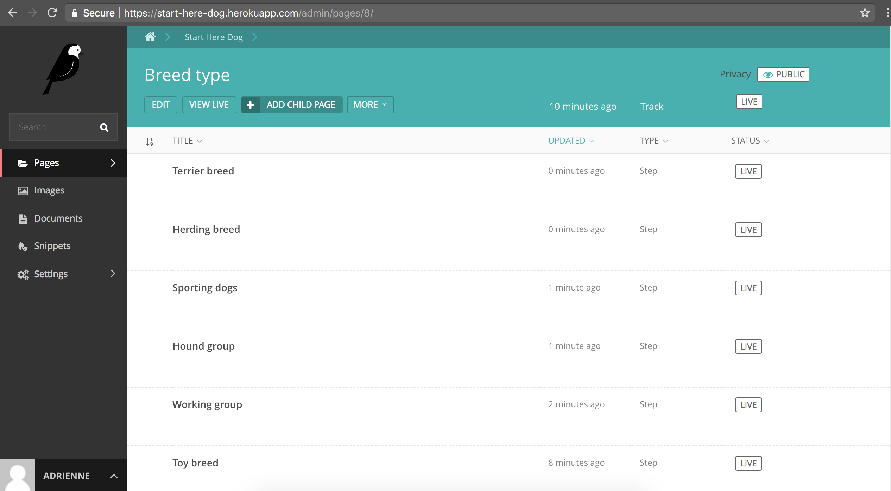
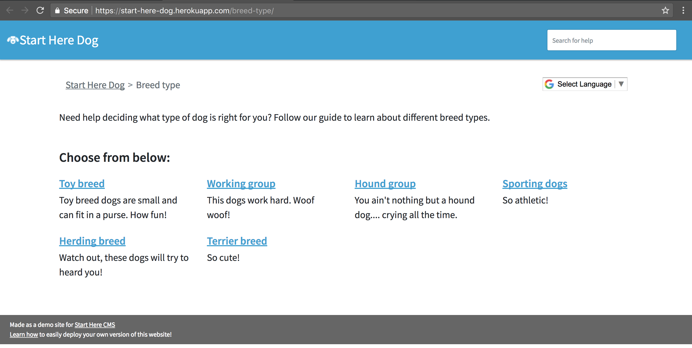

=================
Create a new Step
=================

Steps are pages that help a user complete a Track. In our example about picking a dog breed,
the Steps will look like pages of information about each breed type. Go to the Track you want to create the Step page
for, select "Add Child Page", and select the "Step" type. You should end up with a page that looks like this:

.. image:: ../_static/tutorial/new_step.png
    :align: center
    :alt: An empty Step page form

^^^^^^^^^^^^^^^^^
Video walkthrough
^^^^^^^^^^^^^^^^^

.. image:: ../_static/tutorial/youtube_icon.png
    :align: left
    :alt: An icon of a movie playing

`How to create a basic Step page <https://www.youtube.com/watch?v=c4YlNDVbBrM&feature=youtu.be>`_

^^^^^^^^^^^^^^^^^^^^^^^
Basic Field definitions
^^^^^^^^^^^^^^^^^^^^^^^

.. image:: ../_static/tutorial/definition_icon.png
    :align: left
    :alt: A magnifying glass

**Title** - the name of the page. This will appear as the text in the browser tab and as the header of the page.

.. image:: ../_static/tutorial/definition_icon.png
    :align: left
    :alt: A magnifying glass

**Short description** - offers a preview of what the Step page is about. This will be shown on the Track page to entice people to click on the link to this Step.

.. image:: ../_static/tutorial/definition_icon.png
    :align: left
    :alt: A magnifying glass

**Page Body** - The body of the page. Use this space to educate your user about the Step and send them to useful
websites and resources.

These are the basic fields you need to have a useful Step page.
You'll notice some extra fields that are :doc:`documented later on in our tutorial<extra_step_features>`. You can skip these for now or fill them out immediately, your choice!

After you fill out the above basic fields, you should see something like this:

.. ATTENTION::
    Make sure you add the step pages in the Track page's folder in the admin interface. When you’re in the admin
    you need to make sure your Track page name is listed above the “Add Child Page” button.
    This means that you are adding Steps to that Track page.

After adding step pages for each dog breed my admin view looks like this, with the name of the Track at the top
(Breed Type) and the step pages listed below it.

Now, when you click “View Live” under the name of your track page, you should see a list of all the steps and their
short descriptions displayed. Cool!

Next: :doc:`create_track_form`