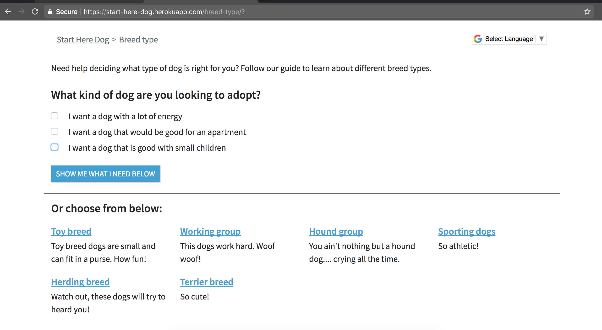
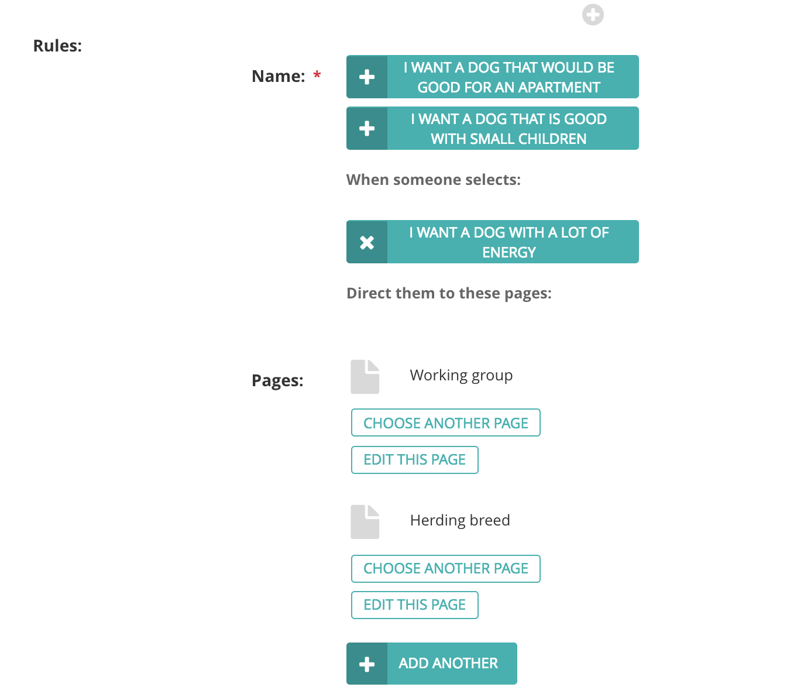
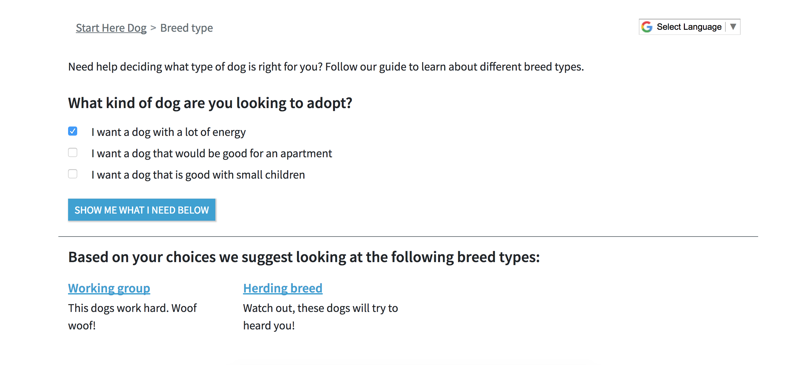
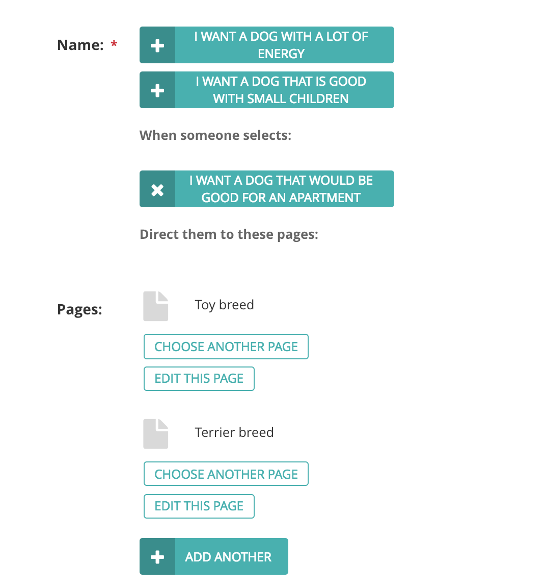
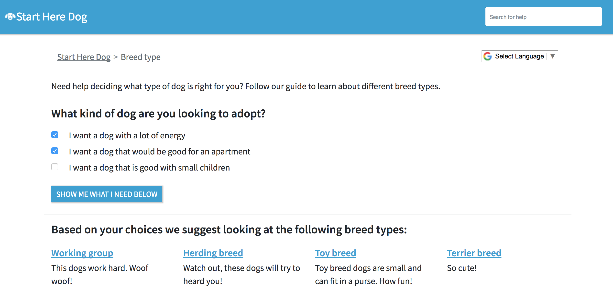
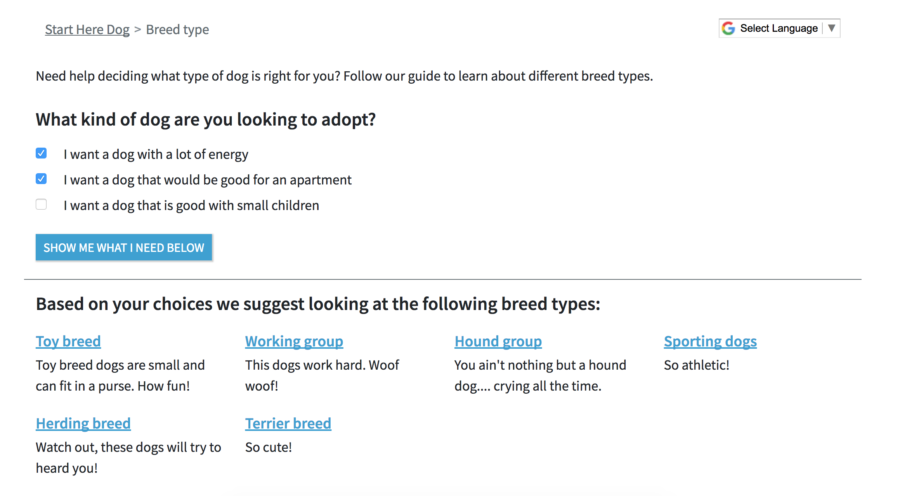
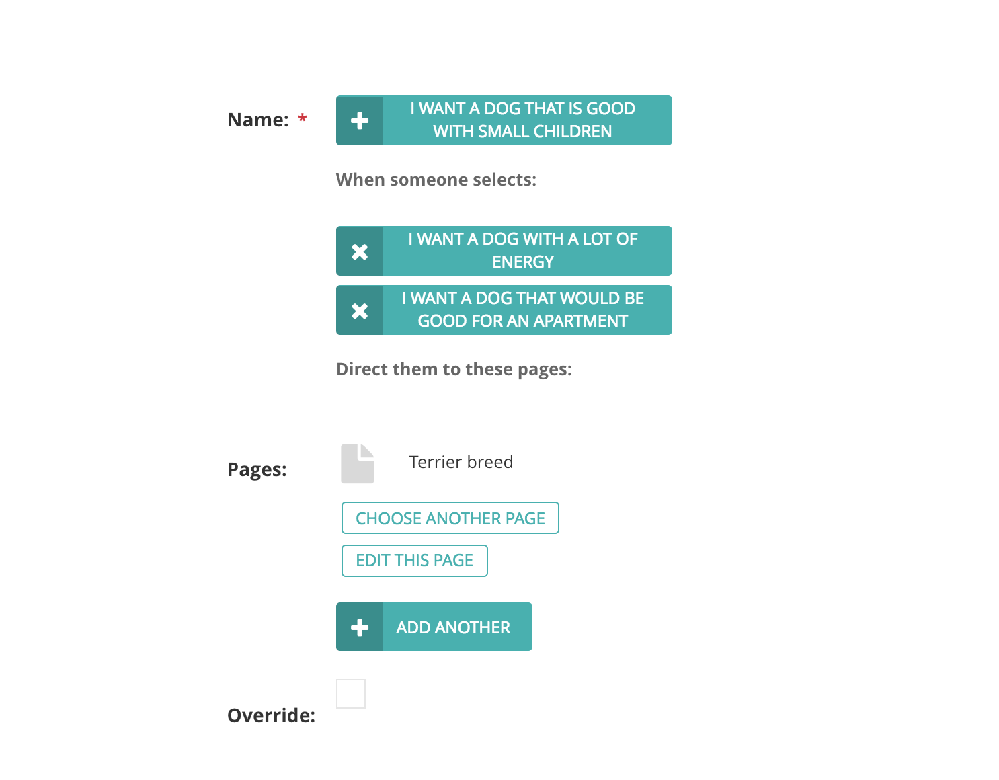
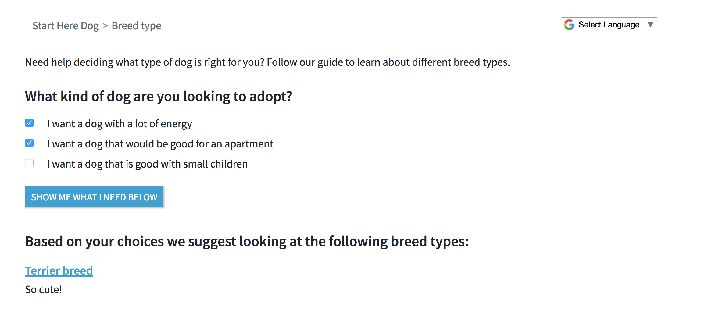
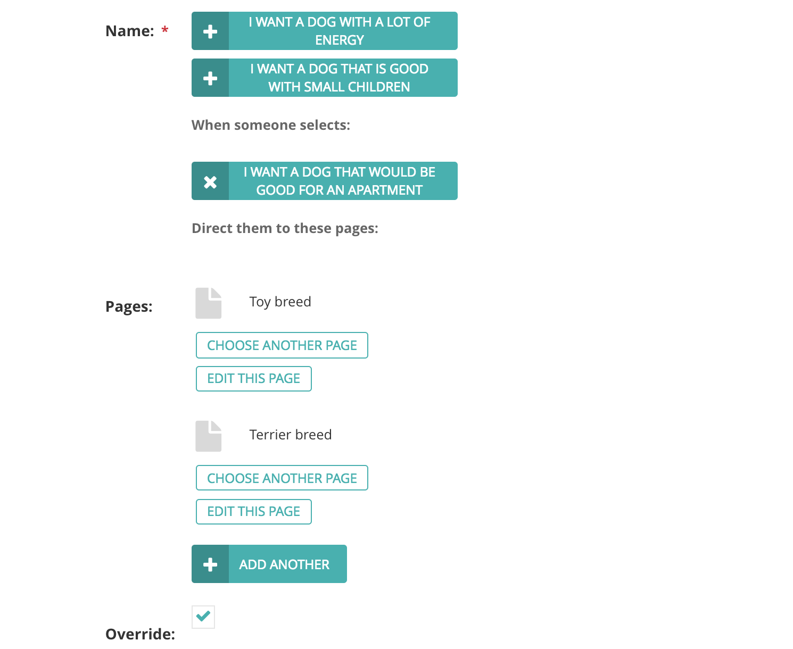

===================
Create a Track form
===================

Some users might need help deciding which Step or Steps is right for them. You can use the  **Options Form** field in
the Track page to create an easy form (aka a quiz or a survey) that helps a user narrow down their options.

For the dog breed Track, let’s create a simple form to help a user decide what dog breeds might be good for
their family:

.. image:: ../_static/tutorial/youtube_icon.png
    :align: left
    :alt: An icon of a movie playing

`How to create a basic Options Form on the Track page <https://www.youtube.com/watch?v=_lzTPVs6TC0&feature=youtu.be>`_

At the end you should see this survey on your Track page:

There’s a lot going on here. Let’s look at the fields we have to fill out.

.. image:: ../_static/tutorial/definition_icon.png
    :align: left
    :alt: A magnifying glass

**Question** - This is the question for your form. Focus on making it simple and easy for someone to answer.

.. image:: ../_static/tutorial/definition_icon.png
    :align: left
    :alt: A magnifying glass

**Choices** - The choices a user can select from to answer the question. You can have as many as you want, but we
recommend keeping it fewer than eight so a user isn’t overwhelmed by the checkboxes.

.. image:: ../_static/tutorial/definition_icon.png
    :align: left
    :alt: A magnifying glass

**Has strict rules** - If this box is checked then the form will only display steps for a rule that matches the exact
choices selected. If this box is not checked the form will display the steps for the union of all matched choices
(explained more below).

.. image:: ../_static/tutorial/definition_icon.png
    :align: left
    :alt: A magnifying glass

**Rules** - These are the rules you need to define to determine what Steps we show to a user based on the choices
they select.

.. image:: ../_static/tutorial/definition_icon.png
    :align: left
    :alt: A magnifying glass

**Default steps** - (optional) If a user selects a choice or combination of choices that do not have associated rules,
then show this list of pages. If no list of default steps is provided, the form will show all the steps
(aka the default of the default is all of the steps)

Let’s look at an example of a rule:

This rule says that if a user selects “I want a dog with a lot of energy” we should show them the Working group and
Herding breed Step pages.

And sure enough, after Publishing with that rule we see the following pages when we select that option:

By default, the rules will work together and show the **union** of the pages for all our choices.
So if we have another rule defined for “I want a dog that would be good for an apartment”

And our user selects both choices from the form, we will show the union of the pages for these two rules:

Cool! But what if you don’t want to show all the pages for each selected choice? What if you wanted to make a different
rule for the combination of “I want a dog with a lot of energy” + “I want a dog that would be good for an apartment”?

Well then you can check the **Has strict rules box** to define a specific rule for that combination. Checking the
Has strict rules box without changing any of the rules shows these steps:

Because we don’t have a rule defined for this combination, the form shows all the steps by default.
Let’s define a rule now!

Now when we select those two choices, we get the step associated with this rule:

Finally, there’s an Override option for each rule. This can be useful to define for a choice if you want its
    selection to override any other defined rules.
For example, let’s say you want the rule for “I want a dog that would be good for an apartment”
    to override any other rule set for that choice.

Now, anytime that choice is selected it will override any other rules associated with it
    (like the last rule for “I want a dog with a lot of energy” + “I want a dog that is good with small children”

.. IMPORTANT::
    Use this override feature sparingly. It can be very powerful but very easy to accidentally make your form unnecessarily complex.

Next: :doc:`extra_step_features`
