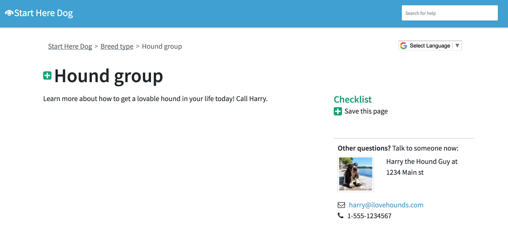
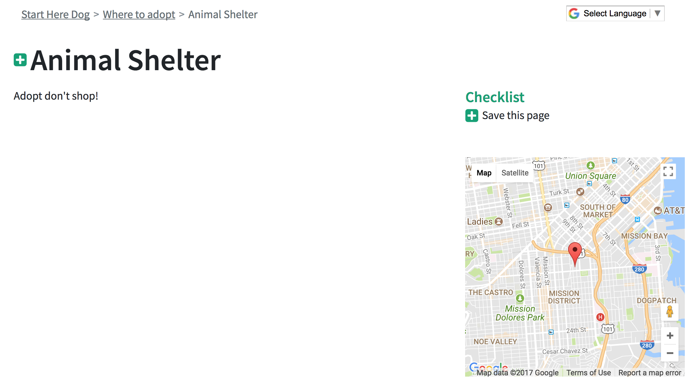
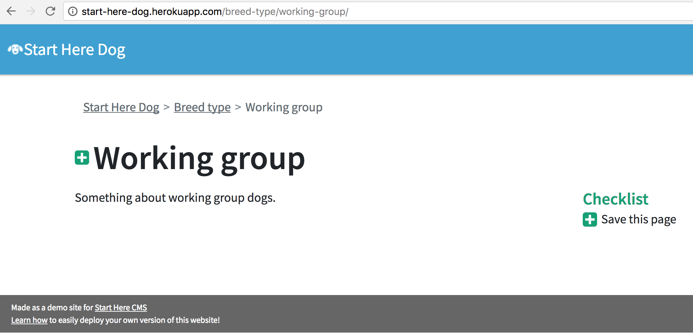
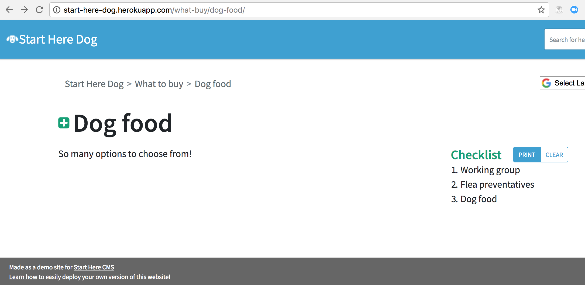
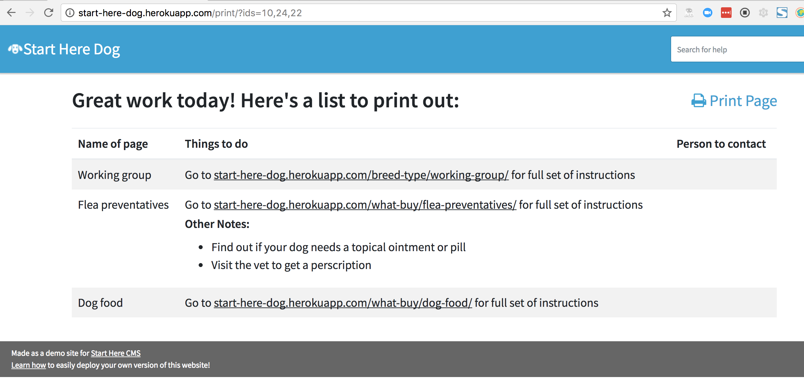

=============================
Extra features for Step pages
=============================

The beauty of a Step page is in its simplicity but sometimes you want to highlight key details.
This Wagtail application lets you define locations and people to contact that can become associated with each Step page.
Let’s walk through how to create them.

----------------
Create a Contact
----------------

**Contact** - Contacts are reusable pieces of information that can be connected to certain Step pages.
Use Contacts to direct your users to useful people and organizations who can provide further help.
They must be created before being selected in the Contact field.

Creating a Contact is as simple as navigating to the “Snippets” link on the left hand navigation bar.

`How to create a Contact for a Step page <https://www.youtube.com/watch?v=eyZZsSH_3Zw&feature=youtu.be>`_

Once you create the Contact, navigate to the Step page and add it as the Contact field:

`How to save a Contact to a Step page <https://www.youtube.com/watch?v=nrOiMjQEk_U&feature=youtu.be>`_

Creating Contacts in Snippets allows you to reuse Contacts across multiple Step pages without having to add the same
information over and over again. This also means that there’s only one place you need to update information in case something
changes about that contact.

After adding a Contact you should see it in the right hand side:

--------------
Add a location
--------------

**Location of the Step** - Sometimes a Step will have a specific location a user can go to. By using Google Maps,
we can highlight that location in the right column under Contacts.

.. NOTE::
    You can only use this field if you have a Google Maps API key defined in your Heroku settings.

This widget uses the GOOGLE_MAPS_API_KEY, GOOGLE_WIDGET_DEFAULT_LAT, and GOOGLE_WIDGET_DEFAULT_LONG
you defined in your Heroku settings earlier.

`How to add a Location to a Step page <https://www.youtube.com/watch?v=epXkZc9vrRA&feature=youtu.be>`_

After you add a location to the page it should look something like this

.. _checklist:

--------------------------
Add checklist instructions
--------------------------
By now you must have noticed this mysterious “Checklist” floating on the right. What’s the purpose of this you ask?
Well in some cases users might want to save a record of the pages they’ve visited and the things they need to do to
accomplish the Steps they are interested.

We designed this checklist feature to do just that.

Using the checklist
'''''''''''''''''''

A user can use the checklist to keep track of what Steps they are interested in. As they navigate your pages they can
add Steps to their checklist using the green + button by the title (or in the Checklist section if the Checklist is
empty)

This is what the user sees when they haven't saved any pages to their checklist on this browsing session:

This is what the user sees after adding some pages to their checklist:

And finally, this is what the "Print" page looks like if a user clicks the button to print out their checklist.
The bullet points of additional information can be provided by the :ref:`Checklist Instructions <checklist_instructions>` field on the Step page template.

Here's a video showing how a user can add a page to the checklist. Note that they can also click the green + button
next to the title text:

`Example of how to use a checklist <http://www.youtube.com/watch?v=9FrUR8tNySU&t=0m29s>`_

Add checklist instructions
''''''''''''''''''''''''''

.. _checklist_instructions:

**Checklist instructions** - A field to let your user know what concrete steps they should take to accomplish this “Step”

`How to add Checklist Instructions to a Step page <https://www.youtube.com/watch?v=9FrUR8tNySU&feature=youtu.be>`_

These instructions are **only** visible when a user goes to print out their checklist.
Don’t use this field to put super important information, just use it as a space to succinctly summarize what a user
needs to do immediately. The URL to the original Step page will automatically be included when the user prints out the
checklist of saved pages.

Next let's set up our sections on the homepage: :doc:`homepage_sections`

