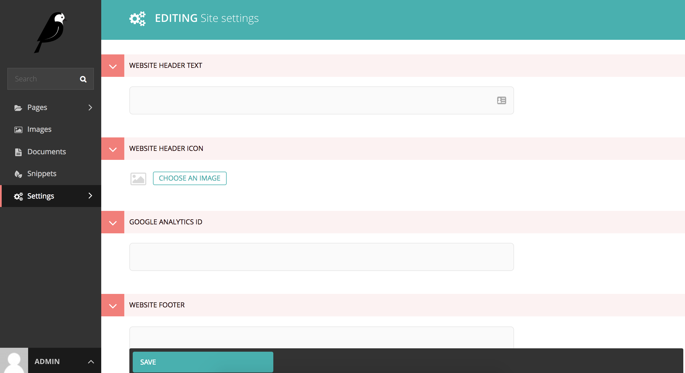
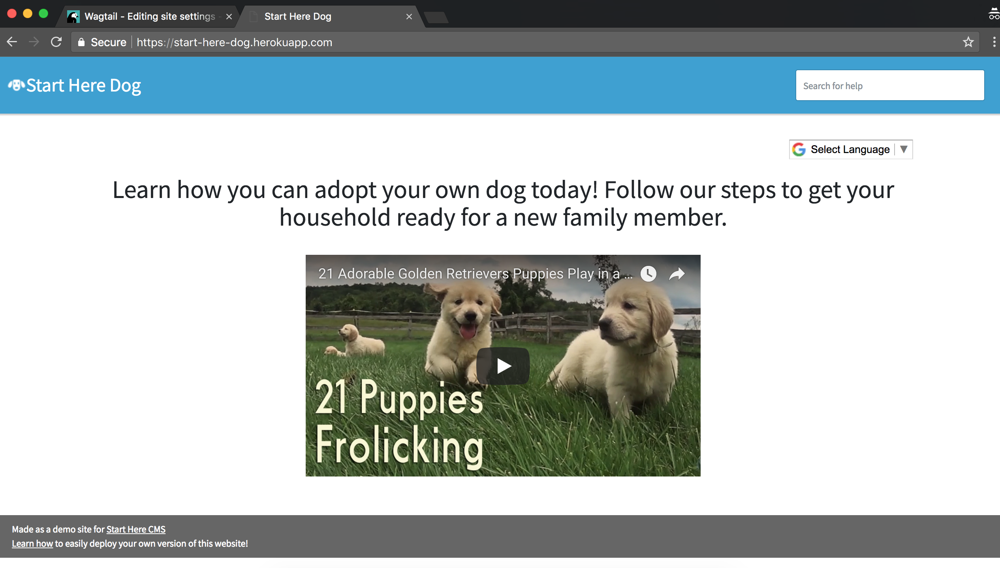

============================
Customize your Site Settings
============================
There a specific section of the admin devoted to global site settings. This includes the header, footer, Google Analytics account, and Algolia account information for search.

.. image:: ../_static/tutorial/youtube_icon.png
    :align: left
    :alt: An icon of a movie playing

`How to get to the site settings <https://www.youtube.com/watch?v=GQfbZNYFCy4&feature=youtu.be>`_

You should see a page like this with empty settings:

.. image:: ../_static/tutorial/definition_icon.png
    :align: left
    :alt: A magnifying glass

**Website Header Text** - The name of your website -- this will appear in the blue header field across all pages.

.. image:: ../_static/tutorial/definition_icon.png
    :align: left
    :alt: A magnifying glass

**Website Header Icon** - An icon that will appear next to the header text. Recommended that it matches your favicon
but not required. It will be rendered at 32px width so try to optimize for that size.

.. image:: ../_static/tutorial/definition_icon.png
    :align: left
    :alt: A magnifying glass

**Google Analytics ID** - Your Google Analytics account information if you want to track your website usage.

.. image:: ../_static/tutorial/definition_icon.png
    :align: left
    :alt: A magnifying glass

**Website Footer** - The text that will appear in the footer (the bottom section)

.. image:: ../_static/tutorial/definition_icon.png
    :align: left
    :alt: A magnifying glass

**Website Favicon** - The image that will appear in the tab for all your pages. We suggest we keep it similar to your
header icon (it can even be the same image as long as the dimensions are correct: 24px x 24px)

.. image:: ../_static/tutorial/definition_icon.png
    :align: left
    :alt: A magnifying glass

**Algolia App ID and Algolia Public Key** - If you want search on your website you need an
`Algolia.com <http://www.algolia.com>`_ account. Once you setup your account paste your App ID and Public Key
here and a search box should appear in the top right corner of the blue header text.

After adding all these site settings you should have a page that looks like this:

Next: :doc:`website_structure`