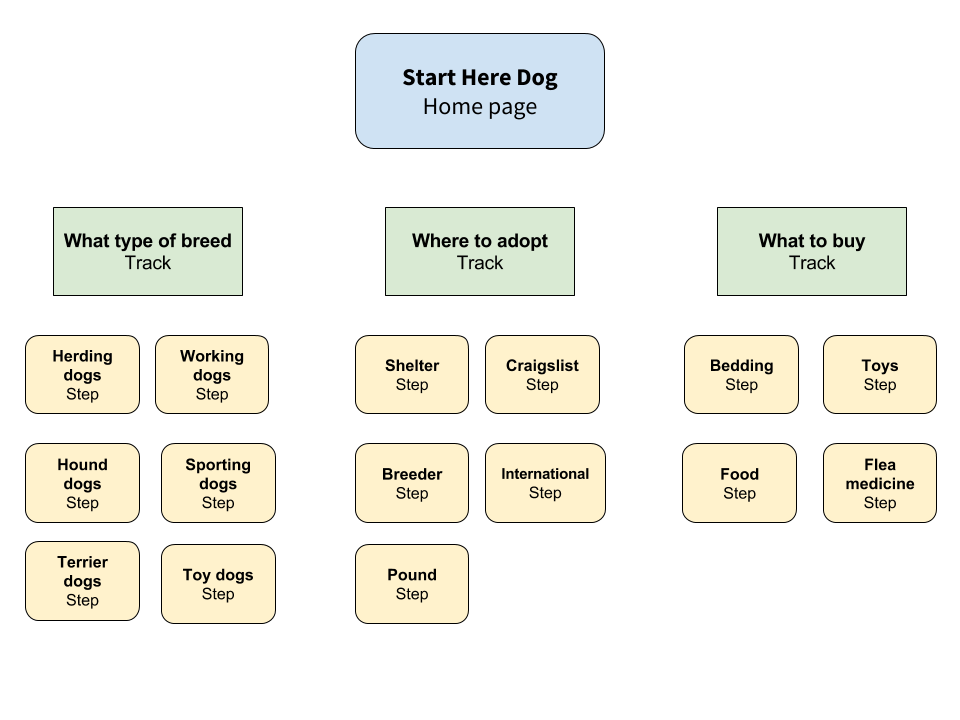

======================================
Planning the structure of your website
======================================

Great! We got a good looking homepage and some basic website configuration setup. Now it’s time for the good stuff: your content!

When you’re designing your website think about the journey the user has to take to accomplish the goal of your website.
For example, in our dog adoption process this journey might be divided into two sections:

1. Things you need to be before adopting a dog
2. Things to do after the adoption

There are many different things that need to be accomplished in each section.
These different “things” are Tracks that a user can take.

In our dog adoption example, let’s start with a couple simple Tracks:

* Picking the breed of dog to adopt
* Where to adopt
* What to buy before bringing the dog home

We have more tips later on but some key things to remember:

1. Do your research! Call organizations that you find to make sure the information on their website is correct before
linking to it.
2. Keep it simple! Many users just want to know what they need to do.

Okay, let’s get started! This will be the basic structure of the website we want to create:

Next: :doc:`create_step`

