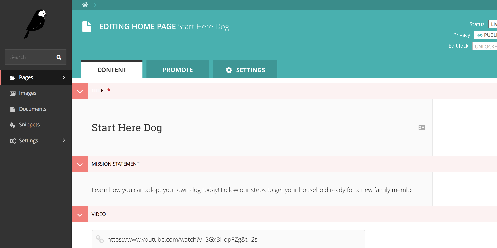
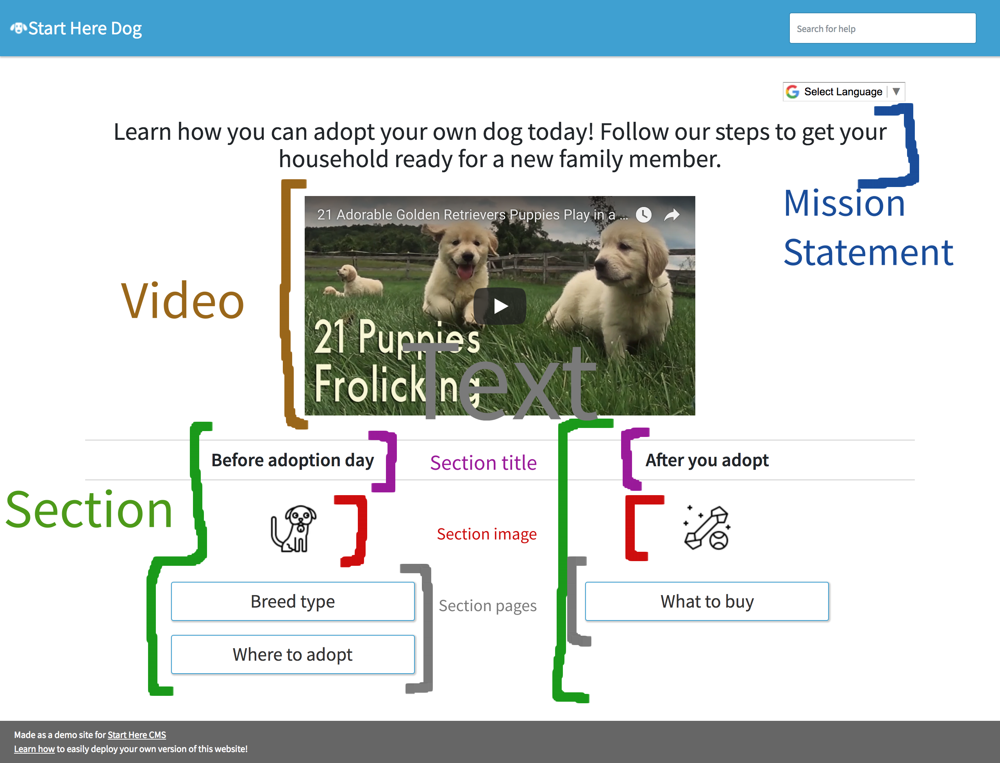

.. _home_page:

=========
Home Page
=========

A Home page has a list of :ref:`Tracks <track>` that a user can take to accomplish their goal. It also has a video
to motivate your user and a short mission statement to outline the purpose of this website.

Here's what the editing template of a Home page looks like:

.. image:: ../_static/wagtail/home_page_admin_2.png
    :alt: The second section of the editing admin for a Home page

And here's how these fields map to the values you see on the website:

