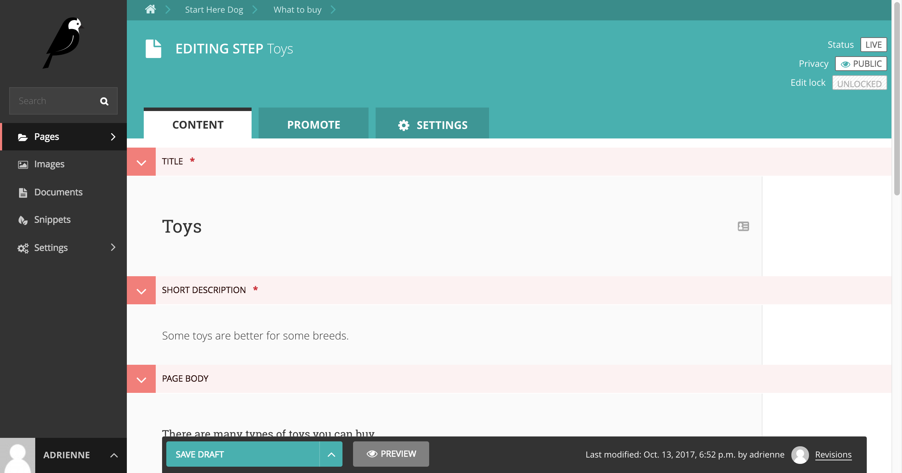
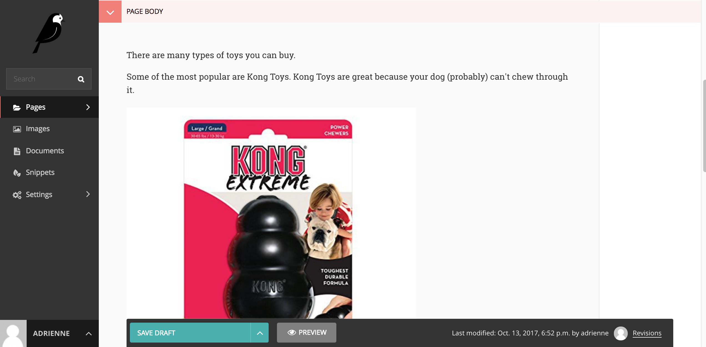
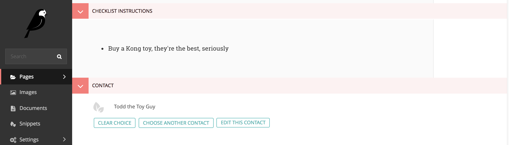
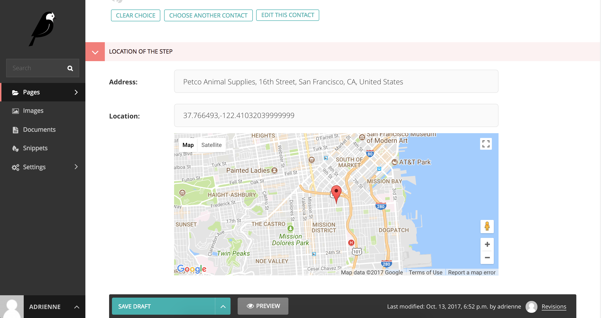
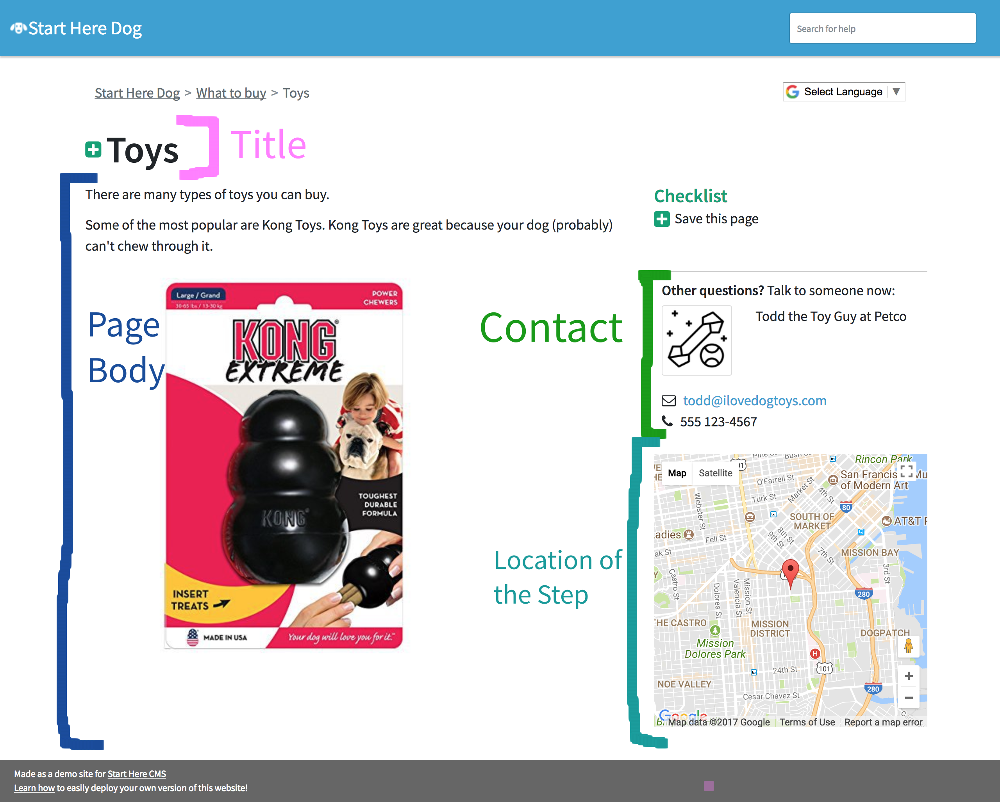
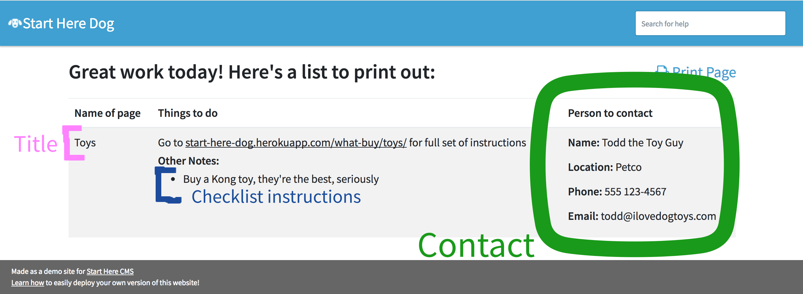
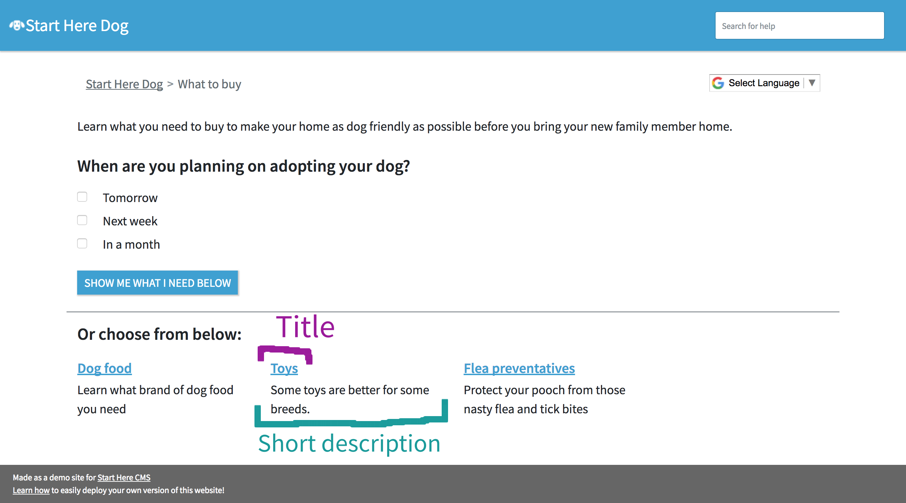

.. _step:

=========
Step Page
=========

A Step page is used to give a user a focused piece of information. There are a bunch of fields you can use to teach
someone about this Step in their journey.

This is what the editing template of a Step page looks like:

And here are where these fields map to on a Step page:

Some of these fields also appear on the Print page for the :ref:`Checklist <checklist>`:

And the short description on the Step page actually appears on the Track Page:

