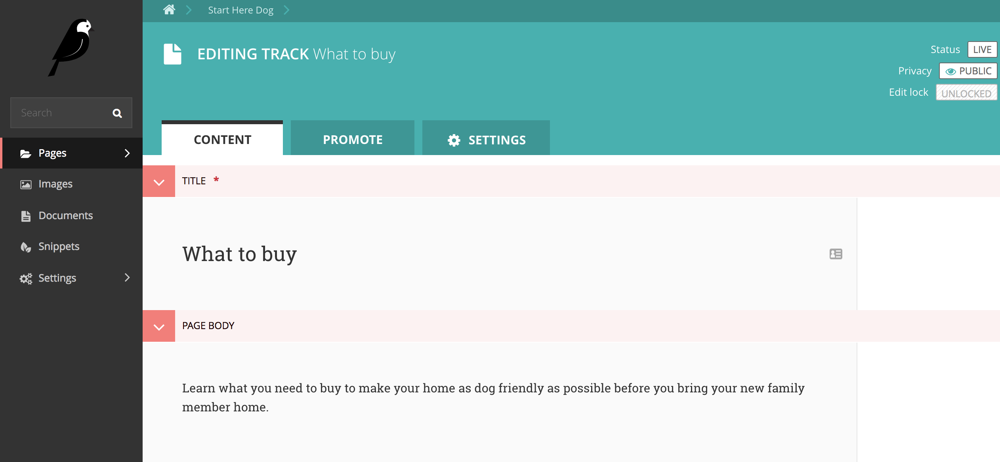
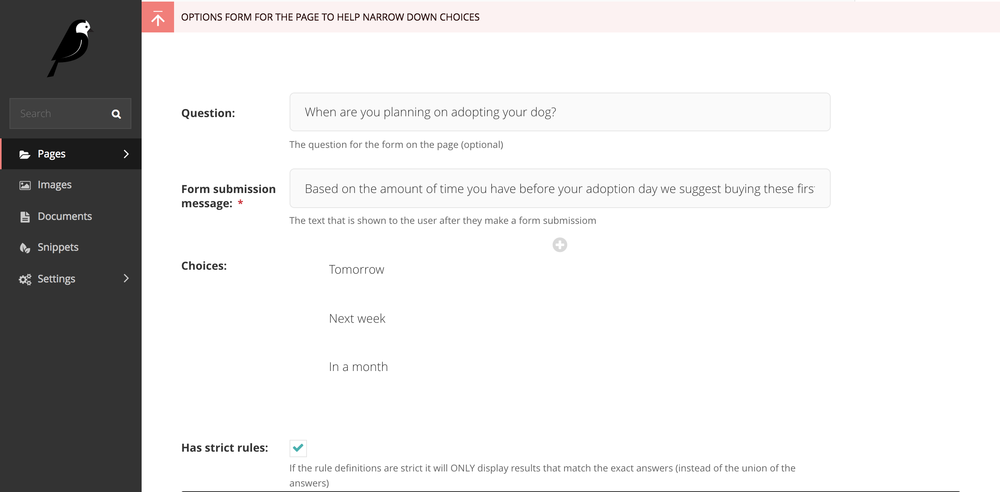
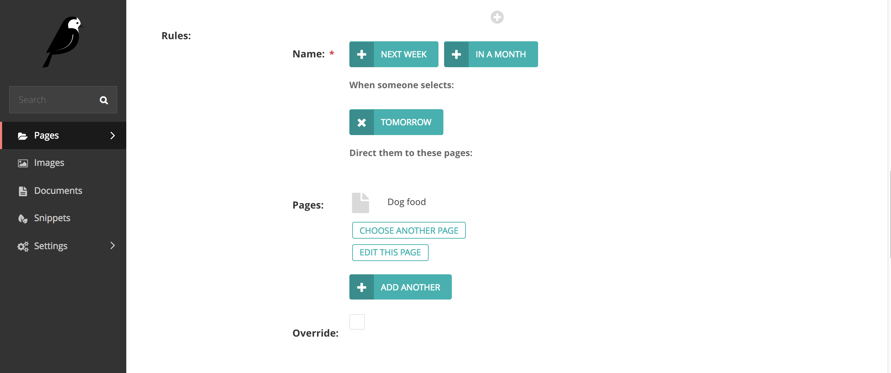
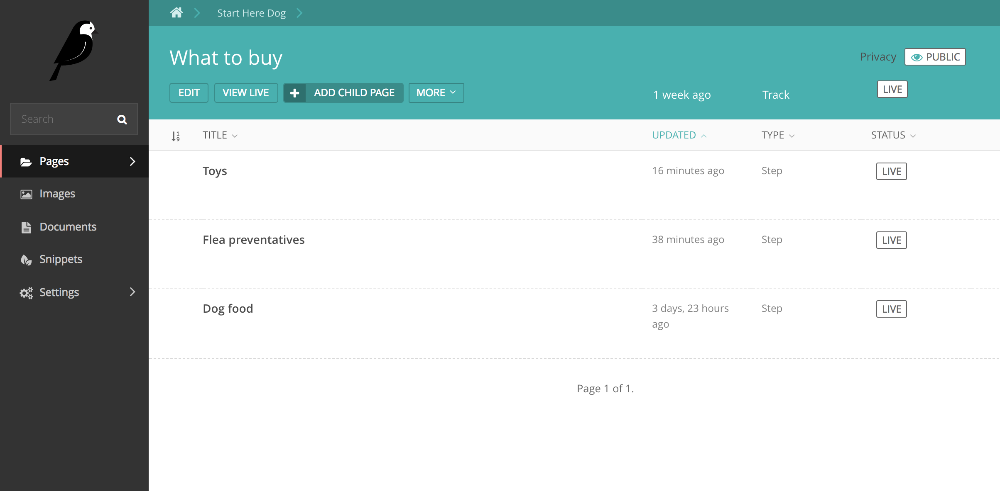
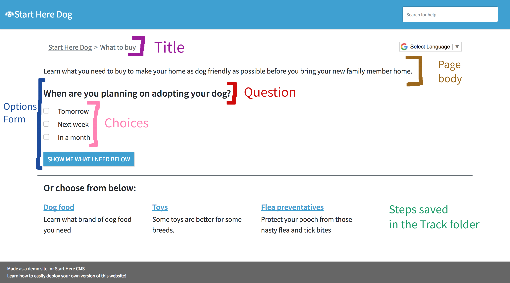
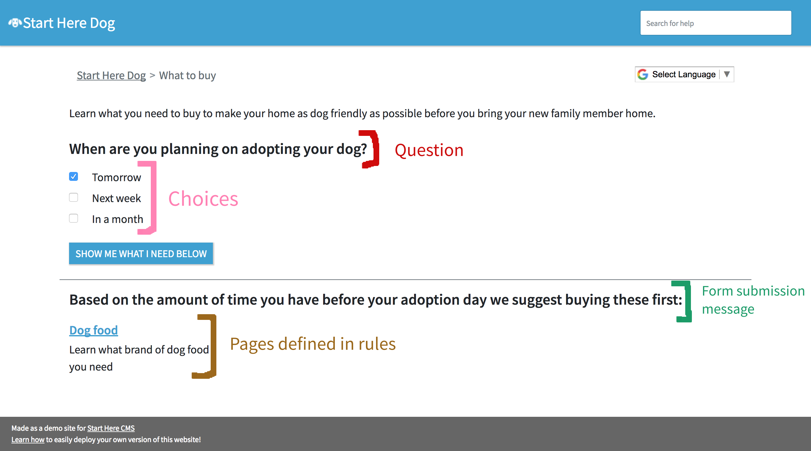

.. _track:

==========
Track Page
==========

A track lists the relavent :ref:`Steps <step>` a user can take to accomplish something.
Tracks also have an optional survey you can create to help a user narrow down their list of things to do and
focus on what they can feasibly get done.

Here's what the editing template of a Track looks like:

Track pages contain a list of Step pages. This is what your file structure should look like:

That's how we know what Steps to automatically list on the Track page:

If you want to defined a form (aka survey) on the page, then these fields map to these values. Please read our full
tutorial about :doc:`creating the Track page Options form. <../tutorial/create_track_form>`

